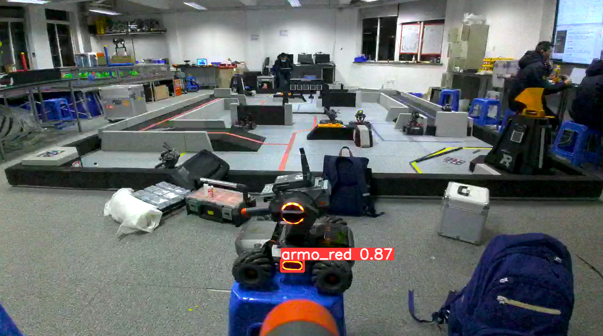

# RMYC-yolo

基于yolo的RMYC自瞄系统（开发中）

如果对这个项目感兴趣的话烦请***star一下***，这对我真的很重要

另外使用本项目请***遵守GPLv3协议***

## 文件结构

- yolov8: yolov8代码(v8.1.0)
  - docs: yolov8官方文档（多语言版）
  - dataset: 数据集存放位置

## 使用教程

### 配置环境

#### yolov8环境配置

参阅[官方文档](https://docs.ultralytics.com/zh/quickstart/#__tabbed_1_2)，注意把pytorch-cuda=11.8替换成自己的版本，cuda版本支持查看[PyTorch官网](https://pytorch.org/get-started/previous-versions/)，cuda版本切换参考[这篇文章](https://blog.csdn.net/qq_50677040/article/details/132131346)，其他环境要求在 */yolov8/pyproject.toml* 中

#### 安装RMSDK

过程请参阅[这篇博客](https://blog.csdn.net/C___programmer/article/details/135486406?spm=1001.2014.3001.5502)，安装完成后运行 *\RMSDK\00_SDK_test.py*

### 模型相关

#### 训练模型

##### 标注数据

首先准备训练的图片，然后下载[labelme最新版](https://github.com/labelmeai/labelme/releases/latest)标注数据

##### 转化txt

把标注好的数据的json文件放到 *\jso2txt\json_here* ，打开 *\json2txt\transfer.py* ，**在第5行把name2id更改为自己数据集的类别名**并运行程序，txt文件会在 *\json2txt\txt_here* 生成

##### 生成训练数据

训练数据放在 *\yolov8\dataset* 下，文件结构参考example文件夹，三个文件夹的作用参考[这篇文章](https://blog.csdn.net/kupepoem/article/details/101055179)，**注意修改detect.yaml的names为自己数据集的类别名**

##### 开始训练

运行 *\yolov8\train.py* ，第9行的参数详见[官方文档](https://docs.ultralytics.com/zh/modes/train/#_4)

#### 使用模型进行推理

- 若想保存推理结果，运行 *\yolov8\detect.py*
- 若想实时显示推理结果，运行 *\yolov8\detect_video.py*

参数详见[官方文档](https://docs.ultralytics.com/zh/modes/predict/#_4)

#### 导出模型

新建一个conda环境，执行以下命令，从之前训练的pt文件中导出opset=19的onnx模型

```bash
pip install protobuf
pip install git+https://github.com/airockchip/ultralytics_yolov8.git@main
yolo export model=path_to_pt_file format=rknn opset=19
```

### Rndis通信

该标题下所有代码**默认位于RMSDK文件夹下**

首先配置香橙派网络

```bash
sudo vim /etc/network/
```

文件最下方加入（usb0请改为自己网卡）

```bash
auto usb0
iface usb0 inet static
address 192.168.42.3
netmask 255.255.255.0
gateway 192.168.1.1
```

随后运行 *01_rndis_test.py* 检查rndis是否可用，运行 *02_SDK_code.py* 输入command，若返回ok;则成功使用sdk在rndis模式下与RMEP通讯

一个很奇怪的现象：貌似香橙派需要用供电线和RMEP连接才能使用rndis通讯，目前不确定这是否是一个发生在我的机器上的bug

### 视频流解码

#### 安装解码器

进入 *03_decoder_install* 先给脚本加权并安装依赖

```bash
sudo apt-get install aptitude libopus-dev cmake
sudo aptitude install libavcodec-dev=7:4.4.1-3ubuntu5
sudo aptitude install libswscale-dev=7:4.4.1-3ubuntu5
pip install "pybind11[global]"
chmod +x ./build.sh
./build.sh
```

安装完成后进入python获取系统路径

```bash
python3
```

进入后输入以下命令

```python
import sys
sys.path
exit()
```

输出的内容就是import默认的检索目录，我这里是 */home/yuanzl/.local/lib/python3.8/site-packages* **（请根据实际情况替换）**

```bash
sudo mv output /home/yuanzl/.local/lib/python3.8/site-packages/DJIdecoder
sudo mv robot_network /home/yuanzl/.local/lib/python3.8/site-packages/robot_network
```

#### 测试解码器

进入 *04_video_stream_test* ，首先安装依赖

```bash
sudo apt-get install python3-pyaudio python3-numpy
python3 liveviex.py
```

如果报错找不到_portaudio，请参考[这篇文章](https://stackoverflow.com/questions/36681836/pyaudio-could-not-import-portaudio)或者运行以下命令

```bash
pip3 install --upgrade Pyaudio
```

### 运行推理

运行 *05_detect_test.py* ，然后你应该就能在画面上看到装甲板的检测结果了



### 加速推理

此时的推理约2fps，效果并不理想，因此使用香橙派5 Plus的RK3588对解码加速

#### 电脑端配置

首先找到一台运行ubuntu的设备（香橙派除外，没有的话可以在windows里跑WSL）

首先下载[rknn-toolkit2]([Releases · rockchip-linux/rknn-toolkit2 (github.com)](https://github.com/rockchip-linux/rknn-toolkit2/releases))，在压缩包的*/rknn-toolkit2/packages*中安装对应python版本的包，安装完以后进入python，执行以下命令，若无报错则安装成功

```python
from rknn.api import RKNN
```

然后下载[rknn_model_zoo](https://github.com/airockchip/rknn_model_zoo/releases)并解压，进入*/examples/yolov8/python*,将自己之前转换好的onnx文件放在该目录下，运行以下命令

```bash
 python3 convert.py best.onnx rk3588 i8 best.rknn
```

参数解析：

`<onnx_model>`: 指定 ONNX 模型路径
`<TARGET_PLATFORM>`: 指定 NPU 平台名称。支持的平台请参考[这里](https://docs.radxa.com/rock5/rock5b/app-development/rknn_install#RKNN-简介)
`<dtype>(可选)`: 指定为 `i8` 或 `fp`。`i8` 用于 int8 量化，`fp` 用于 fp16 量化。
`<output_rknn_path>(可选)`: 指定 RKNN 模型的保存路径


#### 香橙派配置

找到之前下载的[rknn-toolkit2]([Releases · rockchip-linux/rknn-toolkit2 (github.com)](https://github.com/rockchip-linux/rknn-toolkit2/releases))，在*/rknn_toolkit_lite2/packages*中安装对应python版本的包，安装完以后进入python，执行以下命令，若无报错则安装成功

```python
from rknnlite.api import RKNNLite
```
